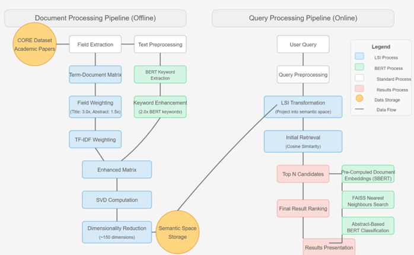
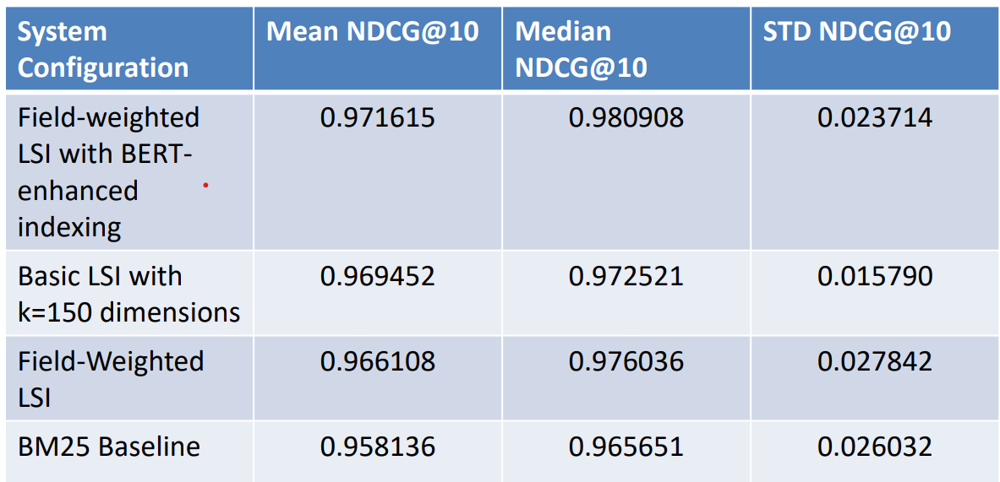

# Latent Semantic Index Search Engine

A sophisticated search engine that provides semantic search capabilities over academic papers, combining the power of Latent Semantic Indexing (LSI) with modern BERT-based neural language models to address synonymy and polysemy challenges in scholarly literature retrieval.

## Project Overview

This search engine implements a hybrid two-stage architecture that combines field-weighted Latent Semantic Indexing (LSI) with BERT-based neural language models. 
* Stage 1 uses field-weighted LSI enhanced with KeyBERT keyword extraction for efficient candidate selection, applying higher weights to: 
    * Keywords (3.0x), 
    * document titles (3.0x) and 
    * abstracts (1.5x) 

* Stage 2 provides
  *  optional BERT-based semantic re-ranking using Sentence-BERT embeddings
  *  with FAISS (Facebook AI Similarity Search) for approximate nearest neighbor search,
  *  followed by a fine-tuned BERT classifier that scores document relevance.
This architecture bridges traditional statistical information retrieval methods with modern neural language understanding, providing both computational efficiency and high-quality semantic search results for scholarly literature.



## Evaluation and Results

The following indexes were built for comparison:

  - **BM25**: Traditional probabilistic ranking baseline
  - **Basic LSI**: Standard Latent Semantic Indexing with uniform weighting
  - **Field-Weighted LSI**: Enhanced LSI with title/abstract/body field weighting
  - **BERT-Enhanced LSI**: Field-weighted LSI with KeyBERT keyword enhancement
  - **Complete Hybrid System**: Full system with BERT-based semantic re-ranking

Our **complete hybrid system** was evaluated on 30 academic queries using NDCG@10 metrics with JudgeBlender relevance assessment. The field-weighted LSI with BERT-enhanced indexing configuration achieved the highest performance with a mean NDCG@10 of **0.9716**, significantly outperforming traditional baselines including BM25 (0.9581) and basic LSI variants. The BERT re-ranking component, fine-tuned on 100,000 MS MARCO query-abstract pairs, demonstrated exceptional semantic similarity assessment with accuracy, precision, and recall scores all exceeding 0.986.



## Demo


## Dataset

The system is implemented using 21,841 academic papers from the CORE dataset, providing a diverse collection across disciplines, time periods, and sources. The architecture is designed to scale efficiently to larger collections, with the ultimate goal of handling the full CORE dataset containing over 300 million scholarly resources.

## Installation

### Environment Setup

The easiest way to set up the environment is using Conda with the provided environment.yml file:

```bash
# Create and activate the environment
conda env create -f environment.yml
conda activate search_engine

# Install frontend dependencies
cd frontend
npm install
cd ..
```

### PyTorch Installation

#### For Windows
```bash
# Install PyTorch with CUDA support
pip3 install torch torchvision torchaudio --index-url https://download.pytorch.org/whl/cu126
```

**Note:** BERT models use GPU acceleration, Windows will require Visual Studio with C++ extensions and runtime libraries.

#### For Linux
```bash
# Install PyTorch with CUDA support
pip3 install torch torchvision torchaudio --index-url https://download.pytorch.org/whl/cu126
```

#### For Mac
```bash
# Install PyTorch (Mac does not support CUDA)
pip3 install torch torchvision torchaudio
```

**Note:** Mac does not support CUDA, so BERT-enhanced models will run on CPU only, which may be significantly slower.

## Usage

### Running the Full Application (Frontend and Backend)

The easiest way to run the complete application is to use the provided controller script:

```bash
# Run both frontend and backend
python run.py
```

This will start:
- The Flask backend API on port 5000
- The React frontend on port 5173 (may be different if the port is already in use)

You can then access the application by opening your browser to http://localhost:5173

### Indexing Documents and Model Setup

**Important note:** If you received this application via Dropbox, the indexes are already built and the BERT model (and the judgeblender LLMs) are already downloaded. You can skip the rest of this instructions and go directly to running the application.

**Only if cloning from GitHub:** You'll need to build the search indexes and download the BERT model (and the judgeblender LLMs from hugging face if you intend to test the evaluation) before using the application.

To build the indexes:

```bash
python src/main.py index
```

This will start an interactive setup that guides you through the indexing process.

### Download BERT Model for Reranking

**Only if cloning from GitHub:** To use the BERT-FAISS reranking feature, you need to download the model:

```bash
python src/main.py download-bert-model
```

This will download the necessary BERT model from Hugging Face for improved search result ranking.


